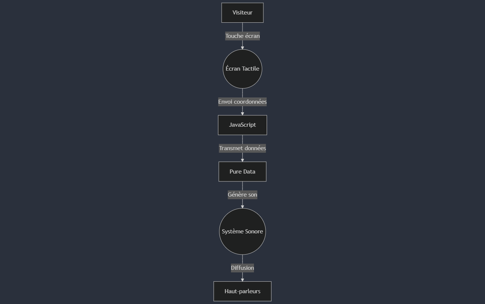
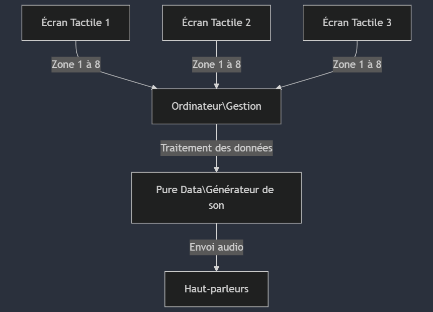
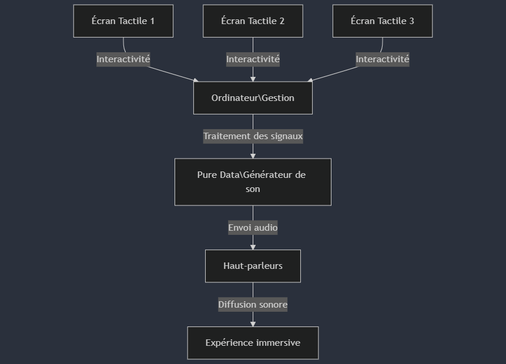
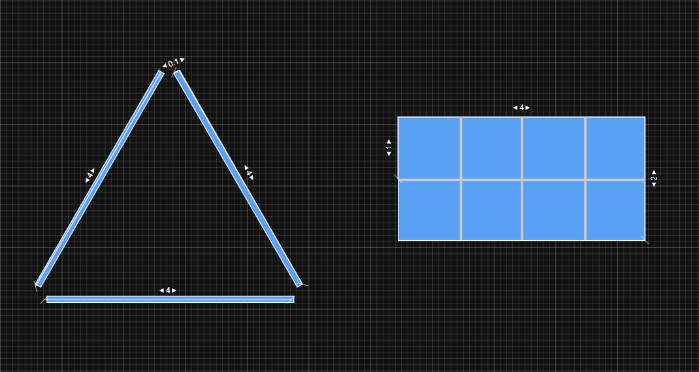

# Tableau Sonore

## Concept

- **Présentation du concept** :

  - **Idée centrale** : Créer une installation composée de trois écrans tactiles, arrangés en triangle équilatéral, qui génèrent des sons musicaux variés lorsque les visiteurs touchent différentes zones sur les écrans.

  - **Objectifs créatifs** : Encourager les visiteurs à explorer et composer une mélodie en interagissant avec les trois écrans, chaque écran ayant des zones sonores distinctes qui déclenchent des sons différents.

- **Références et inspirations** :
  - [Sensor Valley](https://www.studioroosegaarde.net/project/sensor-valley)
  - [Musical Swings](https://musicalswings.com)

---

## Scénario interactif

- **Déroulement interactif** :
  - **Interaction utilisateur** : En touchant une zone sur l’un des trois écrans, le visiteur déclenche un son spécifique (par exemple, une note musicale, une percussion, etc.).
  - **Réponses de l’installation** : Chaque zone activée émet un son particulier, permettant aux utilisateurs de créer une mélodie unique en se déplaçant autour des écrans et en interagissant avec eux.
- **Logigramme des interactions** :

  

## Scénarimage / Simulation

- **Visualisation des séquences** :
  - **Séquence principale** : Visualisation des trois écrans disposés en triangle avec les zones sonores activées lorsque l’utilisateur touche un écran.
- **Illustrations des interactions** :
  - Intégration de captures d'écran ou de croquis montrant les écrans avec les zones de contact principales.

---

## Synoptique

### Schéma technique

- **Zones sonores** : Chaque écran est divisé en zones, permettant d'émettre des sons spécifiques, en lien avec le système sonore.

### Flux de données :

1. **Écrans tactiles** : Les écrans détectent les interactions des utilisateurs.
2. **Système Sonore** : Le système sonore reçoit les informations des écrans et génère les sons correspondants.
3. **Haut-parleurs** : Les sons sont diffusés via les haut-parleurs pour une expérience immersive.

---

## Plantation

 \* **Ratio 1/1 : 1m**

### Emplacement des dispositifs

Les **écrans tactiles** seront disposés en triangle équilatéral, permettant une interaction simultanée et immersive pour plusieurs visiteurs. Chaque écran est conçu pour offrir une répartition sonore équilibrée, créant une expérience sonore harmonieuse. Les **haut-parleurs** seront placés autour des écrans pour renforcer l’effet surround et offrir une immersion sonore complète. Un **ordinateur ou dispositif de lecture sonore** sera discrètement installé pour gérer la diffusion des sons, ainsi que les interactions entre les écrans et le logiciel de traitement audio.

### Circulation des visiteurs

Les écrans seront positionnés au centre de l’espace sous forme de triangle, permettant à plusieurs visiteurs d’interagir sans se gêner mutuellement. L’espace autour des écrans offrira suffisamment de place pour que chaque utilisateur puisse toucher les zones sans entraver les autres.

### Gestion des câblages

Les **câbles** seront soigneusement dissimulés derrière chaque écran pour préserver une esthétique épurée et éviter tout risque de trébuchement. L’**organisation des connexions** garantit une installation sécurisée et visuellement harmonieuse, tout en permettant un accès facile pour d’éventuels ajustements.

---

## Anticiper les besoins matériels et logiciels

### Liste des équipements

- **3 Écrans tactiles** : Écran tactile de 4 x 2 mètres, permettant de diviser l’écran en 8 zones interactives pour déclencher des sons selon les touches de l’utilisateur.
- **Haut-parleurs** : Haut-parleurs stéréo portatifs, diffusant les sons produits par l'installation pour une expérience immersive.
- **Câblages** : Câblage USB et audio de qualité, assurant une connexion fiable et de bonne qualité pour l'audio et les données.
- **Ordinateur / Dispositif de lecture sonore** : Ordinateur portable ou Raspberry Pi, gérant le logiciel de lecture sonore et le traitement des zones tactiles de l’écran.

### Logiciels et réseaux

| Logiciel / Réseau                  | Fonction                                                           | Justification                                                                                                                                                                  |
| ---------------------------------- | ------------------------------------------------------------------ | ------------------------------------------------------------------------------------------------------------------------------------------------------------------------------ |
| **Pure Data**                      | Logiciel de traitement et de lecture sonore                        | Permet de gérer, traiter et déclencher les sons en fonction des données reçues des écrans tactiles.                                                                            |
| **Code personnalisé (JavaScript)** | Gestion des interactions tactiles et envoi des données à Pure Data | Utilisé pour détecter précisément les zones tactiles activées sur les écrans, envoyer les informations de position à Pure Data, et garantir une expérience utilisateur fluide. |
